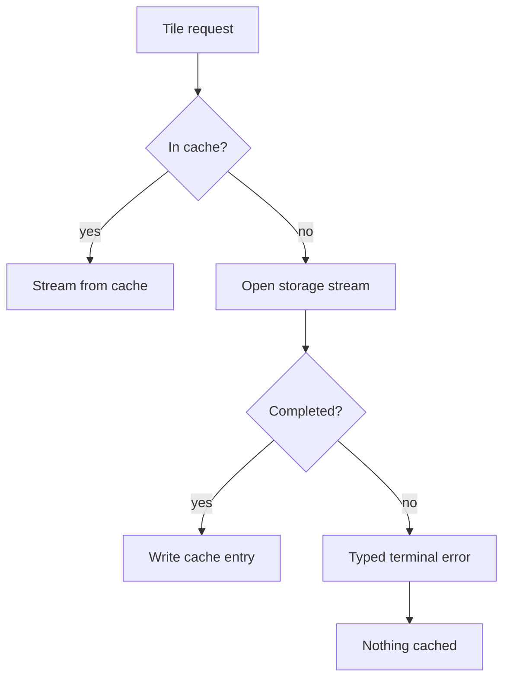

# Story 12.2: Stream Vector Tiles From Object Storage

Status: done
Priority: P0
Size: M

## Story

As a map operator,
I want tiles streamed straight from object storage,
so that a cold region does not hold a worker for the length of a download.

## Acceptance Criteria

1. **Given** a cache miss, **when** the tile is fetched, **then** it is streamed to the client without being buffered whole in memory.
2. **Given** a storage timeout, **when** the stream fails midway, **then** the client receives a typed terminal error and no partial tile is cached.

## Tasks / Subtasks

- [x] 1. Replace the buffered read with a stream (AC: 1)
- [x] 2. Add failure handling for mid-stream aborts (AC: 2)
  - [x] Assert nothing partial reaches the cache.

## Dev Notes

The read path is worth a picture, because the failure branch is the part people
get wrong:

## Change Log

| Date | Change |
| --- | --- |
| 2026-02-20 | Streaming path merged. |
