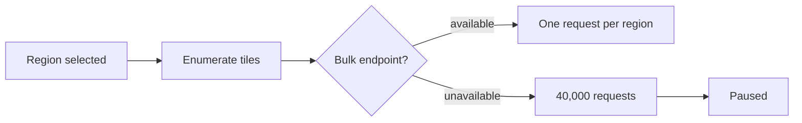

# Tile Ingest Pause - 2026-03-04

## What is paused

Epics 12 and 13 are on hold. Four stories are built and in `review`; none is
`done`, and none should be marked done while the pause holds.

## Why

The tile vendor's REST export returns one tile per request. A single region needs
roughly 40,000 requests, which is not viable inside the sprint's budget. Their
GraphQL preview exposes a bulk endpoint; access has been requested and is
unanswered.

## What is deferred

| Story | What is not proven | Why |
| --- | --- | --- |
| 12.3 | The volume proof | Needs live vendor access |
| 13.3 | Non-destructive import at scale | Needs the volume fixture |

## How to resume

Cut a fresh branch from the integration branch once the vendor answers. The
feature flag defaults to disabled, so the merged work is inert until then.

The epic breakdown is in `_bmad-output/planning-artifacts/epics-sprint-12.md`.
